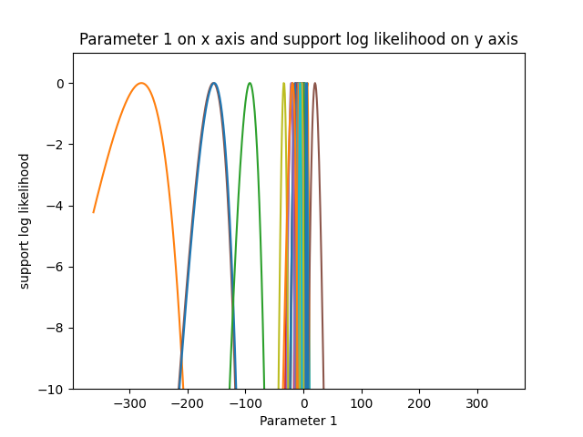
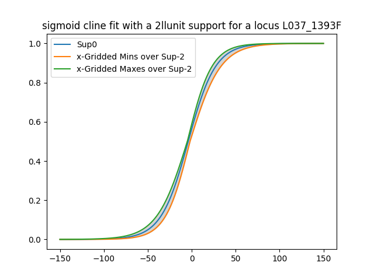
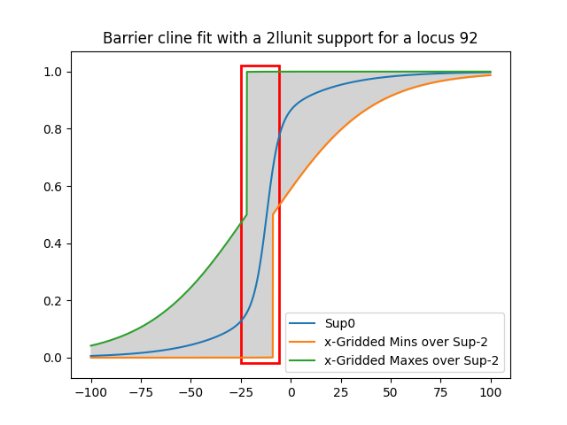

# Clinalyse 
Nina Haladova, Stuart J.E. Baird

2023-03-11
________________

Clinalyse is a toolkit allowing users to analyse multi-locus clines.
More information: **ARTICLE LINK**

## Quick start
Clinalyse provides a python package and a command line interface (cli).
To start, installation through pip command is required:

> pip install clinalyse

Access to GitHub:
**GitHUB LINK**

Whether the user chooses to create their own script in Python or run the cli, 
it will be necessary to start by cleaning the input data. 

Clinalyse has been built for polarised data output from diem [Baird et al., 2022], 
and they should have a certain format. 
The polarised marker values should be in columns, 
the geographic distance ideally as the last column and any empty values should be 
replaced by the 'nan' (not a number) value. This can be achieved either inside the Python 
script or in any other programming language.

| Individuals | Locus 1 | Locus 2 | Locus 3 | Locus 4 | Locus 5 | Geographic distance |
|-------------|---------|---------|---------|---------|---------|---------------------|
| 1           | 0       | 1       | 0       | nan     | 0       | -74.3               |
| 2           | 1       | 1       | 0       | 1       | 0       | 37.6                |
| 3           | 2       | 2       | nan     | 2       | 2       | -1.237              |
| 4           | 2       | 1       | 2       | 2       | 1       | 124.8               |

Example of cleaning data (also available in runner.py):  

    input_data = [ ]
    with open("input_data.csv", "r") as file: 
        csvreader = csv.reader(file, delimiter=",")
        for row in csvreader:
            input_data.append(row)

    cleaned_data = np_f.replace(np.transpose(input_data[1:]), "NO_K_DATA_ID", "nan")
    cleaned_data = np_f.replace(cleaned_data, "kIDbutNoK", "nan")
    cleaned_data = np_f.replace(cleaned_data, "NA", "nan")
    names_of_loci = input_data[0][12:-1]

This table needs to be transposed and converted into a NumPy array like this:

[['2' '0' '0' ... '2' '2' '0']  
['nan' 'nan' 'nan' ... 'nan' 'nan' 'nan']  
........  
['1' '0' '1' ... '1' '0' '1']  
['78.90904753' '-2.776809759' '-23.92075567' ... '112.3880508' '105.0583865' '-8.295206944']]

Meaning, the initial table needs to be transposed and the geographic distances need to be the 
last array. 
Another file to prepare for input is a file containing ploidies of given
loci that should look like this:

| Individuals | Locus 1 | Locus 2 | Locus 3 | Locus 4 | Locus 5 |
|-------------|---------|---------|---------|---------|---------|
| 1           | 2       | 2       | 2       | nan     | 1       | 
| 2           | 2       | 2       | 2       | 2       | 1       |
| 3           | 2       | 2       | nan     | 2       | 1       |
| 4           | 2       | 2       | 2       | 2       | 1       |

Once the data is ready, to fit clines we can choose either a Python script (with more freedom of decisions)
or a command line interface (cli).

### Python Script

Once the input data is provided to Clinalyse, the user can start setting 
up the functions they want to use. The script with examples shows four 
different models - sigmoid, barrier, asymmetric and asymmetric barrier
cline models. To start, the user needs to set the class Profiler which
returns concatenated evaluations during Fibonacci searches for 1D profiles.

    profiler_s = clinalyse.Profiler(d, [fg_c, fg_w], model="sigmoid")
    profiler_s.calculate_profiles(d)
    profiler_s.profiles_save_into_csv()

This code shows the sigmoid model and all possible functionality, the exact same 
functions are available for all models in the runner.py file.
The default path for downloading is set to the current working directory. To turn off
automatic downloading of outputs, the Path parameter needs to be changed to 'None':

     profiler_s = clinalyse.Profiler(d, [fg_c, fg_w], model="sigmoid", Path='None')

To change the default path, the following can be done:

    profiler_s = clinalyse.Profiler(d, [fg_c, fg_w], model="sigmoid", Path='wanted path)

Other possible outputs are graphs for parameter support and clines.

    grapher_s = clinalyse.Graphs(profiler_s.profiles, [fg_c, fg_w], d, model="sigmoid")
    grapher_s.graphing_of_parameter_support()

If we want to download a cline graph, in the first parameter we have to choose
which locus we want to have displayed (in this case locus number 13 - Python
indexing starts at 0). We can also choose the parameter search space zoom (in this
case from -150 to 150).

    grapher_s.cline_graph(14, -150, 150, 0.1)

If we want to highlight a certain portion of the cline, we can use the 
parameter "rect" in this way:

    grapher_s.cline_graph(92, -150, 150, 0.1, rect=[0,0,1,-25])

One of the outputs of clinalyse is also an estimated support - csv containing 
the estimated parameter values for each locus and, in addition, two and three
log likelihood unit supports:

    supporter_s = clinalyse.Support(profiler_s.profiles, [fg_c, fg_w], d, model="sigmoid")
    supporter_s.estimate_support()

These examples are only shown for sigmoid cline model, the easy change 
of the model parameter to 'barrier'/'asymmetric'/'asymmetric_barrier' allows the user 
to calculate all the outputs for the other available models.

### Command line interface
To make the whole process of analysing clines easier and more accessible,
a command line interface is provided in the GitHub repository (**LINK HERE**).
To start with, the user needs to set up the parameters:

> python .\clinalyse_cli.py -m 'sigmoid' -p ./cli -g True -c 4 -f './cleaned_data.csv' -f2 './ploidy.csv' -l './loci_names.csv'

-m stands for model - in this case there are four possibilities: sigmoid, barrier, asymmetric
and asymmetric_barrier  
-p is a path - any existing path can be provided, if None is given, the outputs will not be downloaded  
-g is graphs - a boolean value, when True is chosen, all graphs will be downloaded  
-c is for cores - number of processes which the script should initiate   
-f is file - path to the input data file mentioned above  
-l is for loci - path to the file containing names of loci (in the same order as the initial array)  

The file containing names of loci should be in this format:
['Locus1','Locus2','Locus3',..........,'LocusN']

The cli can be re-run for all models, and it provides the user the same outputs as the Python script.

## Help and acknowledgements
In case of questions or found errors, please get in touch through 
GitHub or stuartj.e.baird@gmail.com.
This package has been created as a Bachelor thesis project by Nina Haladova
under the supervision of Dr. Stuart J.E. Baird.

Cite this work using:
**ADD A CITATITION**

[Baird et al., 2022] Baird S. J. E., Petruzela J., Jaron I., Skrabanek P., 
Martinkova N. 2022. Genome polarisation for detecting barriers to geneflow. 
Methods in Ecology and Evolution, doi: 10.1111/2041-210X.14010.